# 📱 Contact Manager

An enterprise-grade, highly optimized Flutter Contact Management architecture structured on strict clean-coding patterns, complete **BLoC (Business Logic Component) State Management**, and a reactive native storage ecosystem. Built with a production-ready telemetry framework, ensuring zero lag, fully optimized lifecycle management, and a fluid 120Hz user experience.

---

## 🛠️ Production Tech Stack & Architecture
* **State Management:** Flutter BLoC Ecosystem (`contact_bloc`, `theme_bloc`) separating event triggers from pure immutable states.
* **Local Persistence:** High-performance local relational engine via SQLite (`sqflite`) optimized with asynchronous transactional queries.
* **Configuration Cache:** Fast-access synchronous cache bindings via `shared_preferences` to lock and instantly apply localized theme state layers.
* **Graphics Infrastructure:** Powered by Flutter's next-gen **Impeller Rendering Engine** for hardware-accelerated fluid component layouts.

---

## 📸 Complete App Walkthrough & UI Pipelines

### 🚀 1. Bootloader & Cold Start Sequence
The application handles the startup sequence via a two-tier splash architecture. First, the native OS bootlayer triggers, followed instantly by the custom structural app initialization splash view.

| Phase 1: Native OS Boot Layer | Phase 2: Application Core Initializer |
|---|---|
|  |  |

---

### 🗂️ 2. Master Directory, Navigation & Empty States
The core shell integrates a Material Drawer interface. It uses lazy-loaded list view structures to handle full contact datasets, swapping seamlessly into lightweight empty vector screens when databases are unpopulated.

| System Navigation Drawer | Master Contact Directory | Empty Contacts Workspace                                    |
|---|---|-------------------------------------------------------------|
| 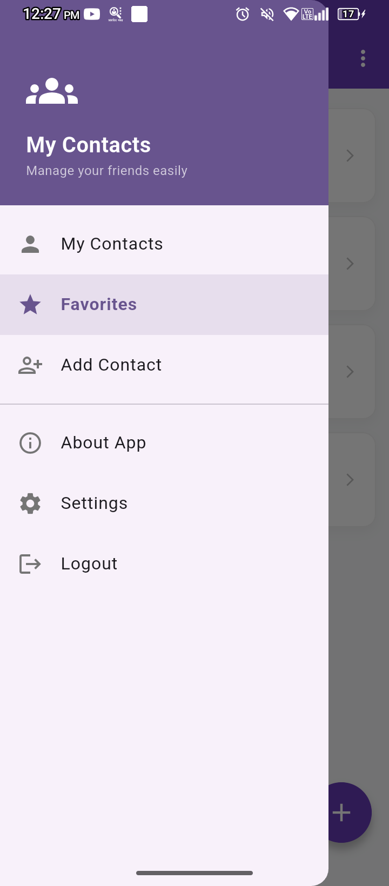 | 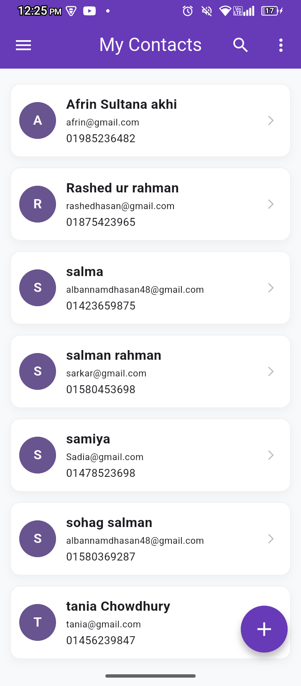 | 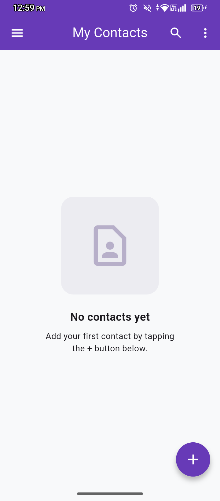 |

---

### ⭐ 3. Favorites Filtering System
An isolated event stream maps filtered entries into a dedicated favorites view. It includes custom layout fallbacks to handle empty favorited lists seamlessly.

| Starred/Favorites Active Directory | Empty Favorites Workspace |
|---|---|
| 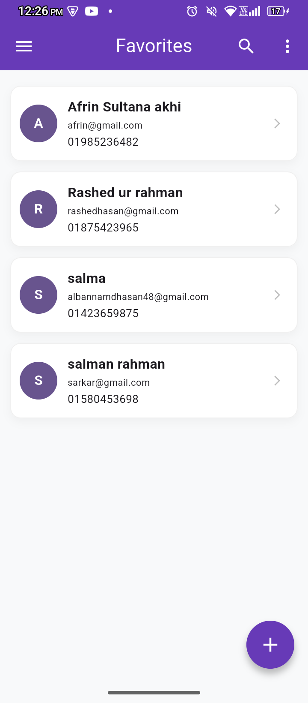 |  |

---

### 📝 4. Node CRUD Lifecycle & Mutation Security
Data entries are deeply validated before being dispatched to the SQLite layer. Modifications auto-trigger state changes across screens, backed by a confirmation dialog to prevent accidental deletion.

| Initialize Contact Node | Contextual Aggregation Details | Live Entry Mutation | Atomic Removal Guard |
|---|---|---|---|
| 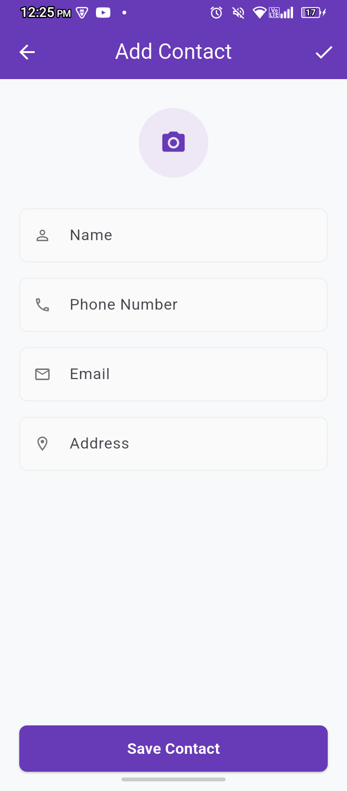 |  |  | 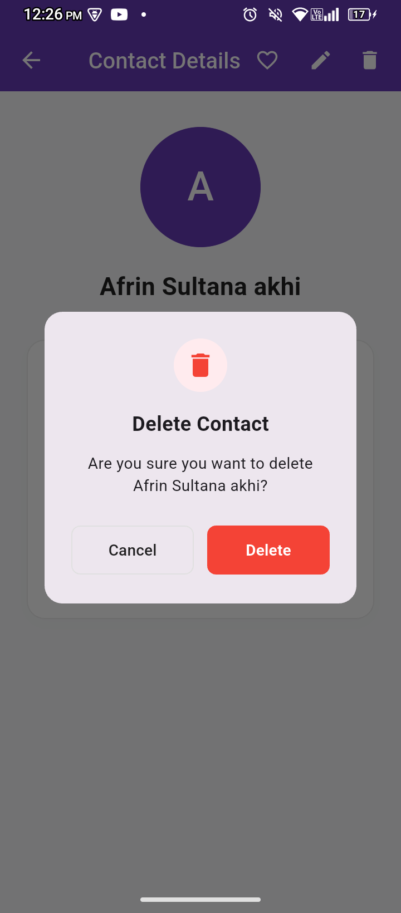 |

---

### ⚙️ 5. Control Dashboard & System Diagnostics
The settings workspace manages runtime UI attributes, persisting preference parameters to the disk immediately upon interaction.

| Local Configuration Center | Application Build Specifications |
|---|---|
| 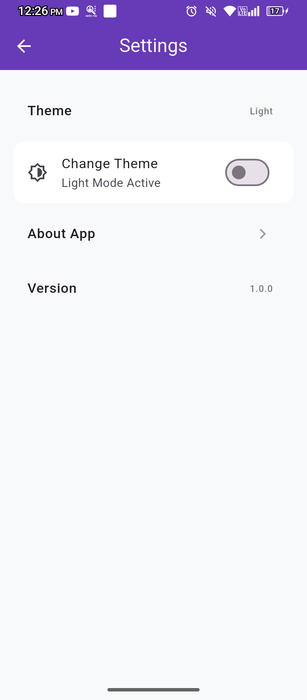 | 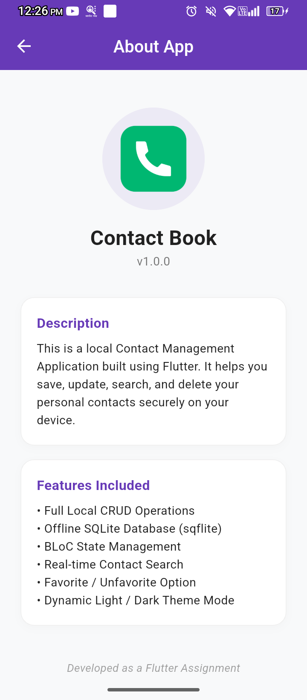 |

---

## 🚀 Performance Benchmarks & DevTools Audit
To guarantee enterprise readiness, the core architecture underwent extensive diagnostic stress testing via **Flutter DevTools** executing strictly inside an isolated **Profile Environment**.

### ⚡ 1. Frame Rate Telemetry & Raster Budgets
* **Average Frame Rate:** **113 FPS** — Consistently maximizing high-refresh-rate display capabilities across performance target devices.
* **Rendering Overhead:** Sub-millisecond pipeline latency ($\le 3\text{ms}$ average runtime execution), safely beneath the rigid $8.3\text{ms}$ processing ceiling for 120Hz viewports.
* **Jank Index:** **0% Frame Drop Anomalies.** Complete absence of thread blocks or skipped micro-tasks during concurrent listing re-builds.

#### 📸 Official Performance Profiler Diagnostics:
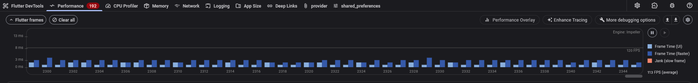

---

### 🧠 2. CPU Execution & Pipeline Budgets
* **Call Stack Optimization:** The system's **CPU Flame Chart** validates highly structured micro-task distribution. Re-rendering procedures generated via `BuildScope.tryRebuild` are isolated locally to individual widgets, bypassing parent hierarchy re-paints.
* **Pipeline Thread Balance:** Concurrent processes handled by `flushLayout` and `flushPaint` retain flat execution properties without structural bottlenecks.

#### 📸 Official CPU Flame Chart Call Stack:
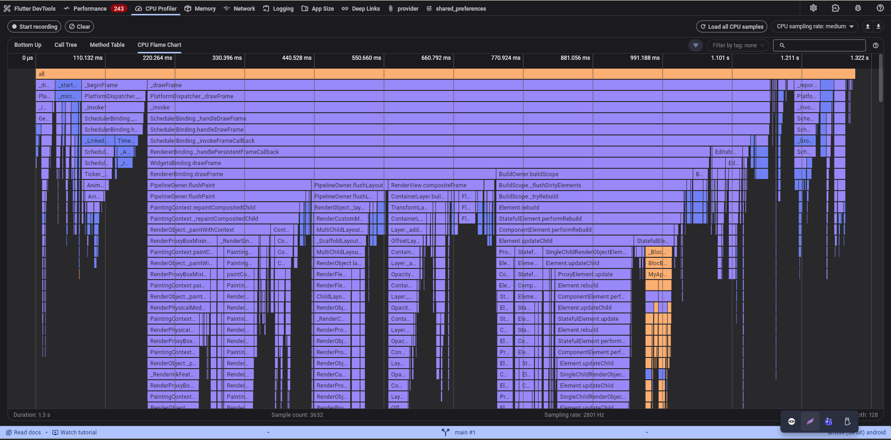

---

### 💾 3. Memory Diagnostics & Heap De-allocation Lifecycle
* **Leak Inspection:** **0% Retained Object Memory Leaks.** Garbage Collection (GC) profiling successfully validated complete resource de-allocation over extensive dataset insert and removal tests.
* **Heap Baseline Stability:** Highly optimized allocation architecture running securely at a flat **14.9 MB**, actively preventing system Out-Of-Memory (OOM) tracking alerts on low-spec client hardware.

| Base Allocation State (Pre-Mutation) | Post-Deallocation Memory Health (Post-GC) |
|---|---|
| 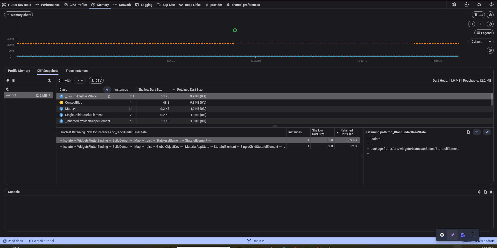 | 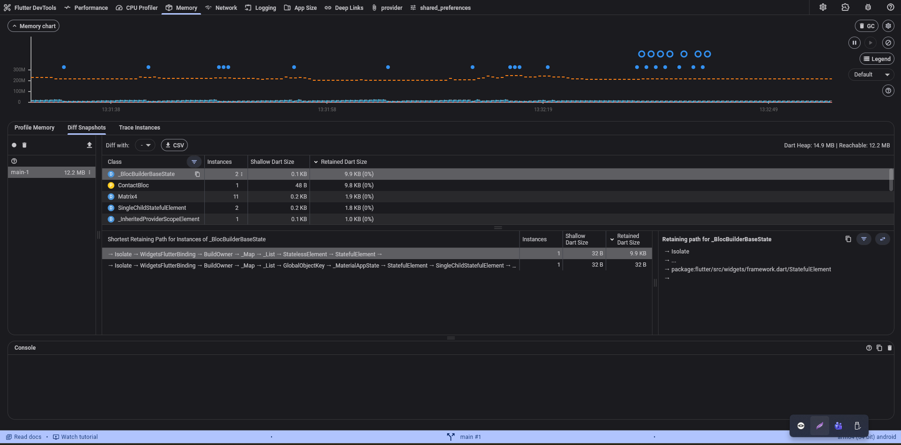 |

---

## 🎯 Architecture Pillars & Implementation Details

* **Separation of Concerns (SoC):** Distinct operational boundaries isolating view layer elements, event dispatch arrays, database queries, and raw business logic streams.
* **Reactive Multi-BLoC Framework:** Implements distinct `ContactBloc` and `ThemeBloc` architectures to decouple data modifications completely from visual look-and-feel state adjustments.
* **Atomic Immutable Operations:** Employs explicit object copies via strict `.copyWith()` mappings inside entities to guarantee complete UI state consistency across async rendering steps.
* **Clean Code Metrics:** 100% compliant with standard professional lint properties, recording `0 warnings / 0 errors` across standard `flutter analyze` tests.

---

## 📁 Repository Blueprint & Directory Mapping
The repository's internal file structure maps perfectly to modern clean architecture patterns:

```text
lib/
├── bloc/
│   ├── contact_bloc.dart        # Manages relational listing transactions & state streams
│   ├── contact_event.dart       # Declares explicit immutable input events for directory mutations
│   ├── theme_bloc.dart          # Manages localized global UI color themes
│   └── theme_event.dart         # Declares system-wide dark/light switch events
├── database/
│   └── db_helper.dart           # Thread-safe SQLite relational CRUD initialization hub
├── models/
│   └── contact_model.dart       # Data serialization templates, factory mappings, & copyWith mutations
├── screens/
│   ├── about_app_screen.dart    # Application profile and specification view
│   ├── contact_details_screen.dart # Aggregates explicit individual contact data attributes
│   ├── contact_form_screen.dart # Consolidated data entry screen for creation/mutation 
│   ├── home_screen.dart         # Core reactive listing panel featuring real-time stream querying
│   ├── settings_screen.dart     # System controller for theme states and preferences
│   └── splash_screen.dart       # First-stage fluid visual state initialization router
├── state/
│   └── contact_state.dart       # Holds immutable view model collections
├── theme/
│   └── app_theme.dart           # Strict light and dark theme configurations
├── widgets/
│   ├── app_drawer.dart          # Global sidebar navigator and drawer layout
│   ├── contact_tile.dart        # Reusable component optimizing internal list rendering
│   └── delete_dialog.dart       # Guard component protecting against accidental data removal
└── main.dart                    # Application structural bootloader and block dependency resolver